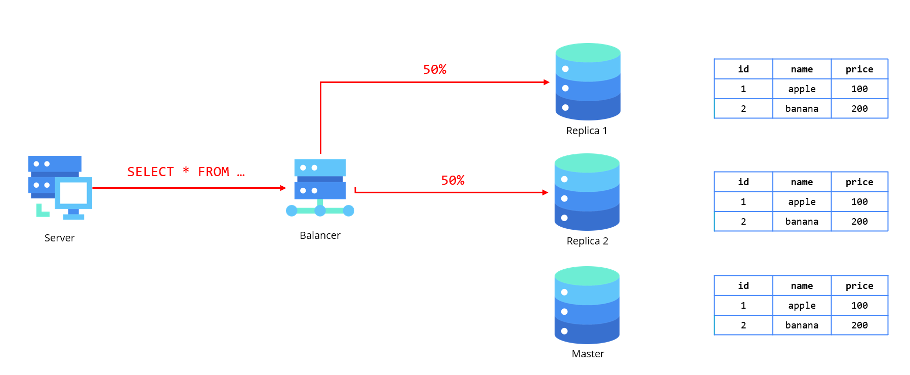
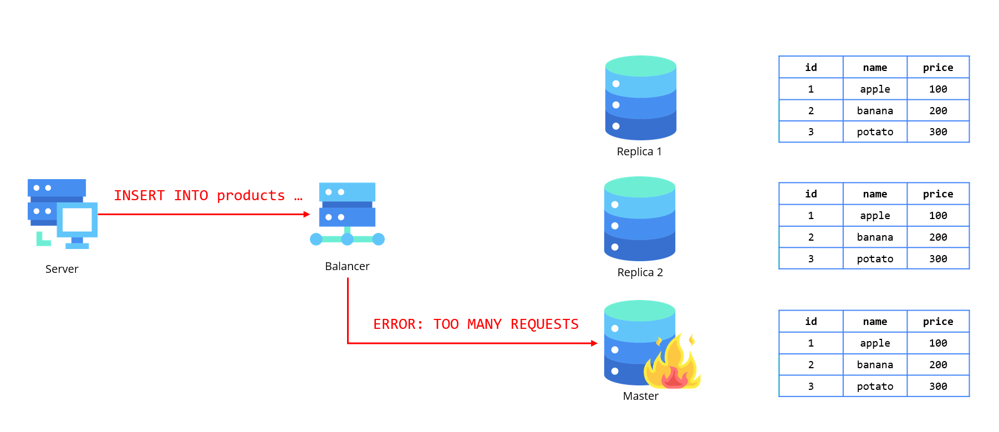

# Масштабирование реляционных баз данных


## Введение

Информационные системы в современном мире сталкиваются с **необходимостью обработки растущих объемов данных**, что предъявляет высокие требования к производительности и отказоустойчивости баз данных. Реляционные СУБД, такие как PostgreSQL, MySQL и Microsoft SQL Server, остаются популярными благодаря своей надежности, строгой схеме данных и поддержке транзакций ACID. Однако при увеличении нагрузки традиционные подходы к проектированию реляционных баз данных могут стать узким местом, приводя к замедлению работы приложений и ухудшению пользовательского опыта.

Масштабирование реляционных баз данных — это комплекс методов, направленных на распределение нагрузки и обеспечение высокой доступности системы. Оно может быть **вертикальным** (увеличение ресурсов сервера) или **горизонтальным** (распределение данных между несколькими узлами). Каждый из этих подходов имеет свои преимущества и ограничения, а их выбор зависит от специфики приложения, бюджета и требований к отказоустойчивости.

В данной статье рассматриваются самые важные стратегии масштабирования реляционных баз данных, включая шардирование и репликацию. Также обсуждаются ключевые проблемы, такие как обеспечение согласованности данных, управление распределенными транзакциями и минимизация задержек в географически распределенных системах.

## Как можно масштабировать реляционные базы данных?

Реляционные базы данных (РБД) — основа многих приложений, но с ростом нагрузки их производительность может снижаться. Чтобы решить эту проблему, применяют два основных подхода: **вертикальное** (scale-up) и **горизонтальное** (scale-out) масштабирование.

### Вертикальное масштабирование

**Вертикальное масштабирование** (scale-up) остается самым простым и предсказуемым способом увеличения производительности реляционных СУБД. Этот подход подразумевает улучшение характеристик сервера: добавление процессорных ядер, увеличение оперативной памяти, использование более быстрых дисковых подсистем. Он не требует изменений в архитектуре приложения и сохраняет все преимущества реляционной модели.

#### Преимущества подхода
Главное достоинство вертикального масштабирования — его концептуальная простота. Администратору не нужно перестраивать логику работы приложения или беспокоиться о согласованности распределенных данных. Все транзакции продолжают выполняться на одном узле, гарантируя соблюдение принципов ACID. Это особенно важно для финансовых систем и приложений, где критична точность данных.

Технически масштабирование сводится к переносу БД на более мощный сервер или изменению конфигурации облачного инстанса. Например, переход с 4-ядерной виртуальной машины на 16-ядерную в AWS RDS может дать немедленный прирост производительности без необходимости изменять SQL-запросы или схему данных.

#### Ограничения и подводные камни
Однако у этого метода есть принципиальные ограничения. Физические пределы серверного оборудования создают естественный "потолок" для масштабирования. Современные серверы верхнего уровня могут иметь до нескольких терабайт RAM и сотни процессорных ядер, но их стоимость становится непропорционально высокой.

Экономика облачных решений усугубляет эту проблему. Цены на мощные инстансы растут нелинейно — переход с 8-ядерной конфигурации PostgreSQL на 64-ядерную может увеличить стоимость в 10-15 раз при реальном приросте производительности всего в 4-6 раз. Кроме того, остается проблема единой точки отказа — выход сервера из строя парализует всю систему.

#### Оптимальные сценарии применения
Вертикальное масштабирование хорошо подходит для систем с предсказуемым и умеренным ростом нагрузки. Например, корпоративные ERP-системы или специализированные отраслевые решения часто десятилетиями работают на вертикально масштабируемых конфигурациях.

Другой типичный случай — стартапы на этапе активного роста. Многие успешные компании (например, Dropbox на ранних этапах) сознательно откладывали переход на распределенные архитектуры, последовательно увеличивая мощность серверов. Это позволяло сосредоточиться на развитии продукта, а не на перестройке инфраструктуры.

#### Переходный этап
Важно понимать, что вертикальное масштабирование — это временное решение. Как показывает опыт Dropbox и других высоконагруженных систем, рано или поздно наступает момент, когда дальнейшее наращивание мощности сервера становится невозможным или экономически нецелесообразным. Однако грамотное использование этого метода позволяет отложить сложный переход к горизонтальному масштабированию до того момента, когда компания будет готова к таким изменениям технически и организационно.

### Горизонтальное масштабирование

**Горизонтальное масштабирование** предполагает добавление новых серверов или узлов в распределённую систему, что позволяет распределить нагрузку между несколькими экземплярами базы данных. Горизонтальное масштабирование может быть реализовано через **шардинг** и **репликацию**.

#### Репликация

**Репликация** — это процесс создания копий базы данных на разных серверах, которые могут использоваться для обработки запросов на чтение. Репликацию можно классифицировать по следующим характеристикам:
- По архитектурному принципу взаимодействия вычеслительных узлов между собой выделяют: репликация с одним ведомым узлом (Master-slave replication), репликация с несколькими ведомыми узлами (Multi-master replication), репликация без ведомых узлов (Masterless replication).
- По принципу перемещения данных на остальные узлы выделяют: асинхронную, синхронную и каскадную репликацию.
- По структуре передаваемых данных на остальные узлы выделяют: физическую и логическую репликацию.

##### Master-Slave репликация

Это один из самых распространённых типов репликации, в котором один сервер является **мастером** (основным),
а остальные — **слейвами** (репликами).

Принцип работы:
- **Мастер-сервер** обрабатывает все запросы на запись (вставку, обновление, удаление).
- **Слейв-серверы** копируют данные с мастера и обрабатывают запросы на чтение. Обычно они синхронизируются с мастером
периодически или с задержкой (в зависимости от конфигурации).

В следующем примере представлена архитектура базы данных, состоящая из трех узлов, один из которых является мастером,
а два других - слейвами. Внутри базы данных имеется таблица products, структура которой описана следующим образом:

```sql
CREATE TABLE products (
    id INT,
    product_name VARCHAR,
    price INT
);
```
Когда пользователь отправляет запрос на балансировщик базы данных, который добавляет новую запись в таблицу, это происходит
с помощью следующего SQL-запроса:

```sql
INSERT INTO products VALUES (3, 'potato', 300);
```

Этот запрос маршрутизируется балансировщиком на мастер-узел, где он успешно записывается.


Затем добавленная запись синхронизируется с оставшимися слейв-узлами, обеспечивая актуальность данных на всех нодах кластера.


Этот тип репликации представляет собой один из **самых простых вариантов**, что является его главным преимуществом в сравнении
с другими подходами. Простота реализации и настройки делает его привлекательным выбором для многих случаев. Однако, помимо
своей очевидной лёгкости, данная репликация позволяет **значительно повысить эффективность обработки запросов на чтение**.
Если в системе присутствует несколько слейвов, каждый из них может обрабатывать запросы на чтение, что способствует
равномерной нагрузке и уменьшает её на каждом отдельном сервере.



Тем не менее наряду с явными преимуществами, этот подход имеет и свои недостатки. Прежде всего, **отсутствие масштабируемости
на уровне мастера** ограничивает возможность разгрузки базы данных от запросов на чтение, что может стать сдерживающим фактором
при росте нагрузки. Также стоит учитывать, что система имеет **единую точку отказа** — мастер. В случае его сбоя кластер временно
теряет возможность записывать данные, что может повлиять на доступность и работу системы в целом.



##### Multi-Master репликация

Это тип репликации, в котором несколько серверов могут выполнять как операции чтения, так и записи. В отличие от модели
мастер-слейв, где только один сервер обрабатывает записи, в мастере-мастере несколько серверов могут одновременно
обрабатывать запросы на запись.

Наиболее распространенная причина иметь многоуровневую установку Multi-Master - это позволить нашему кластеру баз данных
**обрабатывать больше трафика записи**, чем один узел. Вертикальное масштабирование имеет теоретические и практические
ограничения, и машина не может выходить за пределы определенного масштаба.

Как правило, клиенты выбирают один из многих узлов Master для отправки своих запросов на Write. Затем эти обновления
асинхронно распространяются другим Мастерам, сохраняя их синхронизацию с изменениями и делая систему в конечном
итоге последовательной.

В примере имеется следующий кластер, состоящий из 2 мастер нод, каждая из которых имеет в себе по две реплики. На данный
кластер прилетает запрос, на запись от балансировщика на первую ноду мастера.


После добавления новой записи в первый мастер, изменения разносятся на второй мастер, а также на каждую из реплик, добиваясб
таким образом консистентного состояния в кластере.


Данный тип репликации по сравнению с Master-slave хорош тем, что при отказе мастера не произойдёт временной недоступности,
например, если в работоспособности откажет первый мастер, то все запросы балансировщик сразу будет перенаправлять на
второй мастер


После восстановления работоспособности первого мастера, он снова вернётся в балансировку и продолжит свою работоспособность,
при этом синхронизировав свои изменения со вторым мастером


Также такой алгоритм будет работать, например, и при обновлении базы данных до ново версии с отсутствием простоя. Так как
из балансировки сначала будет выводиться и обновляться один мастер, а затем второй

Нужда в split-of-brain ???

Недостатки:

Поскольку репликация между Multi-Master асинхроннами, обновления, сделанные на одном Мастере, займет некоторое время, чтобы поразмышлять о других Мастерах, что делает систему в конечном итоге последовательной. Из-за этой возможной согласованности реляционная база данных, работающая в режиме Multi-Master, потеряет свои гарантии ACID.

Каждое изменение или добавление сущности, происходящее на одном Мастере, должно быть отправлено на каждый другой Узел Мастера в кластере. Это движение данных добавляет значительную нагрузку на пропускную способность сети и может привести к вялой производительности сети в масштабе.

Основной проблемой при запуске базы данных в режиме Multi-Master является Conflict. Поскольку все узлы Мастера принимают записи, могут возникнуть ситуации, когда одна и та же сущность обновляется на нескольких Учителя одновременно, что приводит к конфликтам при синхронизации. То, как эти конфликты решаются, зависит от применения. Некоторые варианты использования предполагают отбросить всю последовательность записей, в то время как другие будут означать, что последняя запись выигрывает. Это становится ответственностью бизнес-логики и варианта использования, чтобы определить шаги, которые должны быть предприняты в конфликте.

##### Синхронная репликация

Это тип репликации, при котором изменения, выполненные на **мастер-сервере**, немедленно транслируются на **слейв-серверы** до того, как транзакция считается завершённой. То есть запись считается успешной только тогда, когда она была успешно записана на всех репликах.

Преимущества синхронной репликации:
- **Гарантированная консистентность данных**: Все реплики всегда имеют актуальные данные, так как запись на мастер-сервере немедленно реплицируется на все слейвы.
- **Высокая степень согласованности**: Система всегда гарантирует, что все копии данных на репликах совпадают с данными на мастер-сервере, что минимизирует риск возникновения несоответствий.

Недостатки синхронной репликации:
- **Задержки при записи**: Из-за необходимости синхронизации с репликами, операции записи могут занимать больше времени. Это может ухудшить производительность системы, особенно при большом количестве записей.
- **Производственные нагрузки**: Из-за синхронизации данных система становится зависимой от скорости передачи данных между мастер-сервером и репликами. Это может стать узким местом для системы.

##### Асинхронная репликация

В этом режиме данные, записанные на **мастер-сервере**, не синхронизируются с репликами немедленно. Реплики получают изменения с некоторой задержкой, в зависимости от настроек синхронизации или интервалов.

Преимущества асинхронной репликации:
- **Высокая производительность**: Поскольку записи на мастер-сервере не ожидают синхронизации с репликами, операции записи выполняются быстро.
- **Минимальные задержки**: Запись данных на мастер-сервере не блокирует процесс выполнения, что улучшает производительность системы.
- **Уменьшение нагрузки на сеть**: Асинхронная репликация не требует постоянного обмена данными между мастер-сервером и репликами в реальном времени.

Недостатки асинхронной репликации:
- **Проблемы с консистентностью данных**: Из-за задержки в синхронизации данных между мастер-сервером и репликами, на репликах могут быть устаревшие данные, что может привести к ошибкам в чтении.
- **Риск потери данных**: Если мастер-сервер выходит из строя до того, как реплики синхронизируют изменения, данные, возможно, будут утеряны.

##### Каскадная репликация

Это тип репликации, при котором слейв-сервер может быть реплицирован на другие слейв-сервера. В этой архитектуре изменения, сделанные на **мастер-сервере**, сначала транслируются на первый уровень реплик, а затем от них — к последующим репликам.

Преимущества каскадной репликации:
- **Оптимизация нагрузки**: Избегается перегрузка мастера и первого уровня реплик, так как реплики могут делегировать часть своих запросов другим репликам.
- **Масштабируемость**: Легко расширять систему за счёт добавления новых слейв-реплик на каждом уровне, что позволяет эффективно распределять нагрузку.
- **Уменьшение трафика на мастер-сервере**: Мастер-сервер загружен только первичной репликацией, а остальные реплики могут передавать данные каскадно, снижая нагрузку на основную базу данных.

Недостатки каскадной репликации:
- **Дополнительная задержка**: Из-за того, что данные передаются через несколько уровней реплик, возникает дополнительная задержка в репликации данных, что может привести к рассогласованию на разных уровнях.
- **Сложность в настройке и управлении**: Поддержка каскадной репликации требует более сложной настройки и мониторинга, так как нужно отслеживать состояние всех уровней реплик.

#### Шардинг (Sharding)

**Шардинг** — это процесс разделения данных на несколько независимых частей (шардов), которые хранятся на разных серверах. Каждый шард содержит только часть данных, что позволяет снизить нагрузку на каждый отдельный сервер.

#### Range-based шардинг (Диапазонный)

Это ...

Как работает:
- Данные распределяются **по диапазонам значений**.
- Обычно используется `id` или временной интервал (`date`).
- Например:
    - `shard1` → `ID от 1 до 1000`
    - `shard2` → `ID от 1001 до 2000`
    - `shard3` → `ID от 2001 до 3000`

Плюсы:
- Простой в понимании
- Запросы по диапазону выполняются **очень быстро**
- Легко добавить новые шарды (создавая новые диапазоны)

Минусы:
- Если один диапазон получает **больше данных**, шард перегружается (нужно **балансировать** данные).
- Может потребоваться **перераспределение данных** при изменении диапазонов.

Когда использовать?
- Если данные можно логически разделить **по ID, дате, регионам**.  
- Хорошо подходит для **временных данных (логи, заказы, события)**.

#### Hash-based шардинг (По хэшу)

Как работает:
- Данные распределяются **равномерно** по шардам с помощью хэш-функции.
- Обычно берется `MOD(N)`, где `N` – количество шардов.
- Например, для 3-х шардов:
    - `shard1` → `id % 3 == 0`
    - `shard2` → `id % 3 == 1`
    - `shard3` → `id % 3 == 2`

Минусы:
- **Нельзя делать диапазонные запросы** (например, `id BETWEEN 1000 AND 2000`).
- Если добавляется новый шард, **все данные нужно перераспределять**.  
- `JOIN` и `GROUP BY` работают **медленнее**.

Когда использовать?  
- Если важно равномерное распределение нагрузки.  
- Подходит для **ключ-значение хранилищ** и **нагруженных API**.

#### Vertical шардинг

**Почему это полезно?**
1. **Ускоряет основную БД** 🏎
    - Если часто выполняются запросы **по ключевым полям (`id`, `name`, `email`)**, они работают быстрее, если в таблице нет "тяжелых" столбцов (`JSONB`, `TEXT`, `BLOB`).
2. **Разгружает дисковую и оперативную память** 💽
    - Большие данные (файлы, логи) хранятся отдельно → индексы в основной БД занимают меньше места.
3. **Оптимизирует бэкапы и репликацию** 🔄
    - Можно делать **бэкапы и репликацию только для важных данных**, а логи хранить отдельно (или вообще не бэкапить).
4. **Гибкость масштабирования** ⚙️
    - Основную БД можно **держать на SSD**, а логи и файлы — на HDD или в облаке (например, в **S3, MinIO**).

#### Directory-based шардинг (Каталожный / Lookup Table)

Как работает:
- Используется **внешняя таблица (lookup table)**, которая **указывает, где хранятся данные**.
- Например, у нас есть таблица, где написано:
    - `user_id 1-1000 → shard1`
    - `user_id 1001-2000 → shard2`
    - `user_id 2001-3000 → shard3`
- Перед выполнением запроса сначала идет запрос в **lookup table**, чтобы узнать, в какой шард отправлять данные.

Плюсы:
- **Гибкость** – можно легко менять логику распределения.
- Хорошо подходит для **динамических систем** (если данные могут мигрировать между шардами).  
- Поддерживает **любую стратегию шардинга** (диапазоны, хэш, регионы и т.д.).

Минусы:
- **Дополнительный запрос** перед основным (может замедлять работу).
- **Точка отказа** – если lookup table перегружена, вся система может тормозить.
- Требует **отдельного механизма обновления данных** (если изменяются шарды).

Когда использовать?
- Если нужно **гибкое распределение данных**.  
- Если шардинг сложный (по регионам, кастомной логике).  
- Подходит для **мультиарендных (multi-tenant) систем**.

##### Проблемы шардинга

- **Сложные межшардовые запросы (JOIN, агрегаты).**
- **Ребалансировка шардов** при изменении количества серверов.
- **Обновление схемы данных** без остановки системы.

## Вывод

Масштабирование реляционных баз данных — это важная задача для обеспечения их высокой производительности и доступности в условиях растущих объемов данных и запросов. Хотя реляционные БД традиционно славятся своей консистентностью и надежностью, с ростом требований к скорости обработки и масштабируемости, многие из них начинают сталкиваться с вызовами. Для решения этих проблем применяются различные подходы, такие как вертикальное и горизонтальное масштабирование, репликация и использование распределенных систем. Каждый из этих методов позволяет эффективно справляться с увеличивающейся нагрузкой, сохраняя при этом принципы работы реляционных БД. В будущем для достижения оптимальной производительности и гибкости, возможно, потребуется комбинированный подход, который объединяет традиционные реляционные технологии с новыми решениями, такими как NoSQL и распределенные системы, чтобы обеспечить быстрое и эффективное управление данными на всех уровнях.
