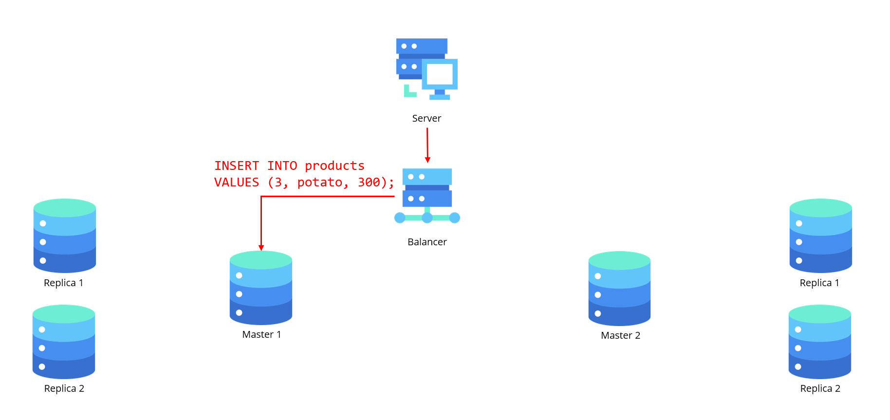
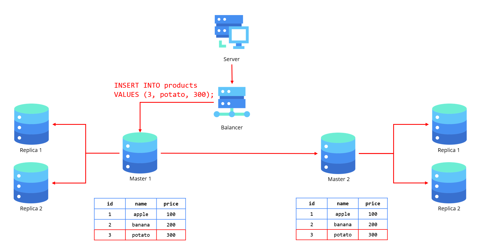
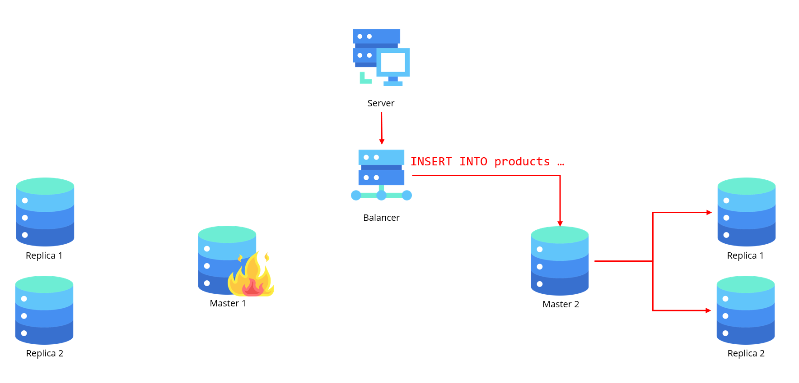
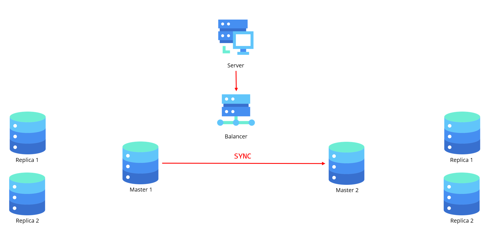

# Масштабирование реляционных баз данных

## Введение

Информационные системы в современном мире сталкиваются с **необходимостью обработки растущих объемов данных**, что предъявляет высокие требования к производительности и отказоустойчивости баз данных. Реляционные СУБД, такие как PostgreSQL, MySQL и Microsoft SQL Server, остаются популярными благодаря своей надежности, строгой схеме данных и поддержке транзакций ACID. Однако при увеличении нагрузки традиционные подходы к проектированию реляционных баз данных могут стать узким местом, приводя к замедлению работы приложений и ухудшению пользовательского опыта.

Масштабирование реляционных баз данных — это комплекс методов, направленных на распределение нагрузки и обеспечение высокой доступности системы. Оно может быть **вертикальным** (увеличение ресурсов сервера) или **горизонтальным** (распределение данных между несколькими узлами). Каждый из этих подходов имеет свои преимущества и ограничения, а их выбор зависит от специфики приложения, бюджета и требований к отказоустойчивости.

В данной статье рассматриваются самые важные стратегии масштабирования реляционных баз данных, включая шардирование и репликацию. Также обсуждаются ключевые проблемы, такие как обеспечение согласованности данных, управление распределенными транзакциями и минимизация задержек в географически распределенных системах.

## Как можно масштабировать реляционные базы данных?

Реляционные базы данных (РБД) — основа многих приложений, но с ростом нагрузки их производительность может снижаться. Чтобы решить эту проблему, применяют два основных подхода: **вертикальное** (scale-up) и **горизонтальное** (scale-out) масштабирование.

### Вертикальное масштабирование

**Вертикальное масштабирование** (scale-up) остается самым простым и предсказуемым способом увеличения производительности реляционных СУБД. Этот подход подразумевает улучшение характеристик сервера: добавление процессорных ядер, увеличение оперативной памяти, использование более быстрых дисковых подсистем. Он не требует изменений в архитектуре приложения и сохраняет все преимущества реляционной модели.

#### Преимущества подхода
Главное достоинство вертикального масштабирования — его концептуальная простота. Администратору не нужно перестраивать логику работы приложения или беспокоиться о согласованности распределенных данных. Все транзакции продолжают выполняться на одном узле, гарантируя соблюдение принципов ACID. Это особенно важно для финансовых систем и приложений, где критична точность данных.

Технически масштабирование сводится к переносу БД на более мощный сервер или изменению конфигурации облачного инстанса. Например, переход с 4-ядерной виртуальной машины на 16-ядерную в AWS RDS может дать немедленный прирост производительности без необходимости изменять SQL-запросы или схему данных.

#### Ограничения и подводные камни
Однако у этого метода есть принципиальные ограничения. Физические пределы серверного оборудования создают естественный "потолок" для масштабирования. Современные серверы верхнего уровня могут иметь до нескольких терабайт RAM и сотни процессорных ядер, но их стоимость становится непропорционально высокой.

Экономика облачных решений усугубляет эту проблему. Цены на мощные инстансы растут нелинейно — переход с 8-ядерной конфигурации PostgreSQL на 64-ядерную может увеличить стоимость в 10-15 раз при реальном приросте производительности всего в 4-6 раз. Кроме того, остается проблема единой точки отказа — выход сервера из строя парализует всю систему.

#### Оптимальные сценарии применения
Вертикальное масштабирование хорошо подходит для систем с предсказуемым и умеренным ростом нагрузки. Например, корпоративные ERP-системы или специализированные отраслевые решения часто десятилетиями работают на вертикально масштабируемых конфигурациях.

Другой типичный случай — стартапы на этапе активного роста. Многие успешные компании (например, Dropbox на ранних этапах) сознательно откладывали переход на распределенные архитектуры, последовательно увеличивая мощность серверов. Это позволяло сосредоточиться на развитии продукта, а не на перестройке инфраструктуры.

#### Переходный этап
Важно понимать, что вертикальное масштабирование — это временное решение. Как показывает опыт Dropbox и других высоконагруженных систем, рано или поздно наступает момент, когда дальнейшее наращивание мощности сервера становится невозможным или экономически нецелесообразным. Однако грамотное использование этого метода позволяет отложить сложный переход к горизонтальному масштабированию до того момента, когда компания будет готова к таким изменениям технически и организационно.

### Горизонтальное масштабирование

**Горизонтальное масштабирование** предполагает добавление новых серверов или узлов в распределённую систему, что позволяет распределить нагрузку между несколькими экземплярами базы данных. Горизонтальное масштабирование может быть реализовано через **шардинг** и **репликацию**.

#### Репликация

**Репликация** — это процесс создания копий базы данных на разных серверах, которые могут использоваться для обработки запросов на чтение. Репликацию можно классифицировать по следующим характеристикам:
- **По архитектуре репликации** между собой выделяют: репликация с одним ведомым узлом (Master-slave replication), репликация с несколькими ведомыми узлами (Multi-master replication), репликация без ведомых узлов (Masterless replication).
- **По принципу синхронизации** на остальные узлы выделяют: асинхронную, синхронную и каскадную репликацию.
- **По уровню передачи данных** на остальные узлы выделяют: физическую и логическую репликацию.

..тут можно ещё что-то добавить, чтобы текст читался более лаконично...

##### Master-Slave репликация

###### Основные положения

Один из наиболее распространённых подходов — **Master-Slave репликация** (также известная как Primary-Replica). [Схема 1: схема работы Master-slave репликации] Эта модель предполагает строгое разделение ролей между узлами: один сервер (master) принимает все операции записи и какую-то часть операций на чтение, а один или несколько подчинённых серверов (slave) синхронизируют данные и обслуживают запросы только на чтение.

Давайте представим, как на самом деле работает эта система. Когда вы отправляете запрос на изменение данных - будь то добавление новой записи (INSERT), обновление существующей (UPDATE) или удаление (DELETE) - всё начинается с **мастер-узла**. Это главный распорядитель, который первым принимает все изменения. Но самое интересное начинается потом, когда эти изменения нужно разослать подчинённым узлам.

###### Уровень передачи данных между узлами

Здесь система предлагает два принципиально разных подхода, каждый со своей особенностью. Первый - это **физическая репликация**, где данные передаются в своём "сыром", нетронутом виде, как есть [Схема 1: формат данных, который передаётся из узела в узел]. Представьте, что мастер просто фотографирует свои бинарные логи - те самые WAL в PostgreSQL или binlog в MySQL - и рассылает эти снимки слейвам. Красота этого метода в его простоте и точности: реплики получают данные в точно таком же виде, в каком они существуют на мастере. Но за эту точность приходится платить - все узлы должны быть похожи как близнецы, работать на совместимом железе и одинаковых версиях ПО.

...можно привети примеры, как это сделано в PostgreSQL и MySQL...

А теперь второй подход - **логическая репликация** - это уже более интеллектуальный способ общения между узлами [Схема 2: формат данных, который передаётся из узела в узел]. Здесь мастер не просто копирует данные, а фактически пересказывает, что именно произошло: "Я только что добавил новую запись в таблицу пользователей", или "Я обновил цену в товаре с ID 42". Это как разница между отправкой фотографии документа и его кратким изложением по телефону. Такой подход куда более гибкий - он позволяет реплицировать только отдельные таблицы, работать с разными версиями СУБД и даже немного корректировать данные по пути.

...можно привети примеры, как это сделано в PostgreSQL и MySQL...

И в этом танце данных есть ещё один важный ритм - **принцип синхронизации**, который будет рассмотрен в следующей главе.

###### Принципу синхронизации данных между узлами

Теперь давайте разберёмся с тем, как именно данные попадают с мастера на реплики. Здесь есть два принципиально разных подхода, каждый из которых хорош для своих задач.

Представьте оживлённое кафе в час пик. Официант принимает заказы, быстро кивает клиентам и сразу бежит к следующему столику, не дожидаясь, пока кухня приготовит каждое блюдо. Это и есть асинхронная репликация в мире данных — мастер-узел, как расторопный официант, подтверждает операции, не дожидаясь их полной обработки на репликах.

**Асинхронная репликация** — это как отправить письмо по электронной почте. Мастер вносит изменения в свою базу и сразу же возвращает клиенту подтверждение, не дожидаясь, пока реплики получат эти данные. [Схема 3: последовательность действий при асинхронной репликации] Только после этого в фоновом режиме начинается процесс синхронизации. Это даёт максимальную скорость отклика, но есть небольшой риск: если мастер упадёт сразу после подтверждения записи, но до отправки данных на реплики, эти изменения могут потеряться.

| Проблема |	Последствия	| Методы решения |
|----------|--------------|----------------|
| Временная рассогласованность | Пользователи видят устаревшие данные |	- Временные маркеры "обновляется" - Чтение после записи (read-after-write) для критичных данных
| Риск потери данных | Последние изменения пропадают при сбое мастера |	- Полусинхронная репликация для критичных операций - WAL-логи с подтвержденной записью
| Конфликты обновлений | Конкурирующие изменения на разных узлах | - Векторные часы для определения порядка - Алгоритмы разрешения конфликтов (CRDT)
| Накопление отставания |	Реплики не успевают за мастером при нагрузке | - Автомасштабирование реплик - Ограничение скорости записи

**Потеря данных при сбое основной ноды**
Асинхронная репликация подразумевает, что данные сначала записываются на мастер ноду, а затем (с задержкой, другими словами создаётся окно неконсистентности данных) отправляются на реплики. Если основная нода выходит из строя до того, как изменения попали на реплики, такие данные теряются.

**Полу-синхронная репликация** (Semi-synchronous replication) - включает промежуточный этап, при котором транзакция считается завершённой только после того, как хотя бы одна реплика подтвердила получение данных. Это снижает вероятность потери данных сохраняя приемлемую производительность.

**Журналирование на клиентской стороне** - клиенты могут логировать транзакции до подтверждения их основным узлом и повторно отправлять при сбое. Однако этот подход усложняет архитектуру.

**Введение промежуточного кэширующего слоя (например, WAL Proxy)** - Данные сначала пишутся в устойчивый лог, который одновременно ретранслируется в мастера и реплики.

**Задержка репликации (replication lag)**

Из-за отсутствия синхронизации в реальном времени, данные на репликах могут отставать от мастера на значительное время, особенно под высокой нагрузкой.

**Мониторинг и алерты по lag-метрикам** - использование метрик вроде Seconds_Behind_Master (MySQL) позволяет отслеживать задержку. В случае повышения порогов можно временно исключить реплику из пула чтения.

**Разделение нагрузки между мастером и репликами** - Минимизация чтений/записей, чтобы уменьшить отставание.

**Использование более эффективных протоколов репликации** - например, физическая репликация быстрее логической, особенно при большом количестве DML-операций.

**Аппаратные улучшения** - быстрые диски (NVMe), оптимизация сетевого стека, увеличесние буферов и размер пакетов в настройках репликации.

**Несогласованность данных**

Из-за задержки данные на репликах не гарантируют точного соответствия мастеру. Это особенно критично для сценариев, где читается недавно записанная информация (Read-Your-Writes Consistency).

**Согласованное маршрутизирование запросов** - использование middleware или proxy, которые маршрутизируют клиентские запросы так, чтобы клиенты после записи всегда читали с мастера.

**Версионирование данных** - система может отслеживать версии объектов и сравнивать их между узлами, обеспечивая согласованность при необходимости.

**Использование CRDT** (???) - для специфических доменов можно применять структуры, допускающие асинхронную репликацию с разрешением конфликтов без потери данных.

**Failover и Split-Brain**

В случае выхода мастера из строя и автоматического переключения на реплику може произойти ситуация split-brain - одновременная запись в два несовместимых источника истины.

**Использование механизмов quorum'a** - репликация и выбор мастера осуществляется на основе большинства (например, через Raft или Paxos), исключая возможность split-brain

**Fencing токены (например, Zookeeper fencing)** - каждому лидеру выдаётся уникальный токен, предотвращающий "двойное лидерство"

**Использование consensus-сервисов** - etcd, consul, zookeeper обеспечивает отказоустойчивый контроль за лидерством и конфигурацией.

**Выбор стратегий автоматического или ручного failover** - в критичных системах предпочтительнее использовать ручной failover с предварительным анализом состояния реплик.

**Синхронная репликация** работает иначе — больше похоже на видеозвонок с подтверждением. [Схема 4: последовательность при синхронной репликации] Когда поступает запрос на запись, мастер сначала отправляет данные всем настроенным репликам и ждёт их подтверждения. Только получив "ок" от всех (или от заданного количества узлов), он подтверждает операцию клиенту. Это гарантирует, что данные точно не потеряются при сбое, но зато ощутимо замедляет работу системы — особенно если реплики географически разнесены.

На практике часто используют **гибридные решения**. Например, в PostgreSQL можно настроить синхронную репликацию только для критически важных транзакций, а всё остальное пускать асинхронно. [Схема 5: пример гибридной настройки] Или сделать синхронной только одну из нескольких реплик — это даёт баланс между надёжностью и производительностью.

Главный выбор здесь — между скоростью и надёжностью. Для социальной сети, где можно на секунду потерять последний лайк, подойдёт асинхронный вариант. А для банковских операций или медицинских систем, где каждая запись должна быть сохранена наверняка, без синхронной репликации не обойтись. [Схема 6: сравнительная таблица подходов]

##### Multi-Master репликация

Это тип репликации, в котором несколько серверов могут выполнять как операции чтения, так и записи. В отличие от модели
мастер-слейв, где только один сервер обрабатывает записи, в мастере-мастере несколько серверов могут одновременно
обрабатывать запросы на запись.

Наиболее распространенная причина иметь многоуровневую установку Multi-Master - это позволить нашему кластеру баз данных
**обрабатывать больше трафика записи**, чем один узел. Вертикальное масштабирование имеет теоретические и практические
ограничения, и машина не может выходить за пределы определенного масштаба.

Как правило, клиенты выбирают один из многих узлов Master для отправки своих запросов на Write. Затем эти обновления
асинхронно распространяются другим Мастерам, сохраняя их синхронизацию с изменениями и делая систему в конечном
итоге последовательной.

В примере имеется следующий кластер, состоящий из 2 мастер нод, каждая из которых имеет в себе по две реплики. На данный
кластер прилетает запрос, на запись от балансировщика на первую ноду мастера.

После добавления новой записи в первый мастер, изменения разносятся на второй мастер, а также на каждую из реплик, добиваясб
таким образом консистентного состояния в кластере.

Данный тип репликации по сравнению с Master-slave хорош тем, что при отказе мастера не произойдёт временной недоступности,
например, если в работоспособности откажет первый мастер, то все запросы балансировщик сразу будет перенаправлять на
второй мастер

После восстановления работоспособности первого мастера, он снова вернётся в балансировку и продолжит свою работоспособность,
при этом синхронизировав свои изменения со вторым мастером

Также такой алгоритм будет работать, например, и при обновлении базы данных до ново версии с отсутствием простоя. Так как
из балансировки сначала будет выводиться и обновляться один мастер, а затем второй

Нужда в split-of-brain ???

Недостатки:

Поскольку репликация между Multi-Master асинхроннами, обновления, сделанные на одном Мастере, займет некоторое время, чтобы поразмышлять о других Мастерах, что делает систему в конечном итоге последовательной. Из-за этой возможной согласованности реляционная база данных, работающая в режиме Multi-Master, потеряет свои гарантии ACID.

Каждое изменение или добавление сущности, происходящее на одном Мастере, должно быть отправлено на каждый другой Узел Мастера в кластере. Это движение данных добавляет значительную нагрузку на пропускную способность сети и может привести к вялой производительности сети в масштабе.

Основной проблемой при запуске базы данных в режиме Multi-Master является Conflict. Поскольку все узлы Мастера принимают записи, могут возникнуть ситуации, когда одна и та же сущность обновляется на нескольких Учителя одновременно, что приводит к конфликтам при синхронизации. То, как эти конфликты решаются, зависит от применения. Некоторые варианты использования предполагают отбросить всю последовательность записей, в то время как другие будут означать, что последняя запись выигрывает. Это становится ответственностью бизнес-логики и варианта использования, чтобы определить шаги, которые должны быть предприняты в конфликте.

##### Синхронная репликация

Это тип репликации, при котором изменения, выполненные на **мастер-сервере**, немедленно транслируются на **слейв-серверы** до того, как транзакция считается завершённой. То есть запись считается успешной только тогда, когда она была успешно записана на всех репликах.

Преимущества синхронной репликации:
- **Гарантированная консистентность данных**: Все реплики всегда имеют актуальные данные, так как запись на мастер-сервере немедленно реплицируется на все слейвы.
- **Высокая степень согласованности**: Система всегда гарантирует, что все копии данных на репликах совпадают с данными на мастер-сервере, что минимизирует риск возникновения несоответствий.

Недостатки синхронной репликации:
- **Задержки при записи**: Из-за необходимости синхронизации с репликами, операции записи могут занимать больше времени. Это может ухудшить производительность системы, особенно при большом количестве записей.
- **Производственные нагрузки**: Из-за синхронизации данных система становится зависимой от скорости передачи данных между мастер-сервером и репликами. Это может стать узким местом для системы.

##### Асинхронная репликация

В этом режиме данные, записанные на **мастер-сервере**, не синхронизируются с репликами немедленно. Реплики получают изменения с некоторой задержкой, в зависимости от настроек синхронизации или интервалов.

Преимущества асинхронной репликации:
- **Высокая производительность**: Поскольку записи на мастер-сервере не ожидают синхронизации с репликами, операции записи выполняются быстро.
- **Минимальные задержки**: Запись данных на мастер-сервере не блокирует процесс выполнения, что улучшает производительность системы.
- **Уменьшение нагрузки на сеть**: Асинхронная репликация не требует постоянного обмена данными между мастер-сервером и репликами в реальном времени.

Недостатки асинхронной репликации:
- **Проблемы с консистентностью данных**: Из-за задержки в синхронизации данных между мастер-сервером и репликами, на репликах могут быть устаревшие данные, что может привести к ошибкам в чтении.
- **Риск потери данных**: Если мастер-сервер выходит из строя до того, как реплики синхронизируют изменения, данные, возможно, будут утеряны.

##### Каскадная репликация

Это тип репликации, при котором слейв-сервер может быть реплицирован на другие слейв-сервера. В этой архитектуре изменения, сделанные на **мастер-сервере**, сначала транслируются на первый уровень реплик, а затем от них — к последующим репликам.

Преимущества каскадной репликации:
- **Оптимизация нагрузки**: Избегается перегрузка мастера и первого уровня реплик, так как реплики могут делегировать часть своих запросов другим репликам.
- **Масштабируемость**: Легко расширять систему за счёт добавления новых слейв-реплик на каждом уровне, что позволяет эффективно распределять нагрузку.
- **Уменьшение трафика на мастер-сервере**: Мастер-сервер загружен только первичной репликацией, а остальные реплики могут передавать данные каскадно, снижая нагрузку на основную базу данных.

Недостатки каскадной репликации:
- **Дополнительная задержка**: Из-за того, что данные передаются через несколько уровней реплик, возникает дополнительная задержка в репликации данных, что может привести к рассогласованию на разных уровнях.
- **Сложность в настройке и управлении**: Поддержка каскадной репликации требует более сложной настройки и мониторинга, так как нужно отслеживать состояние всех уровней реплик.

#### Шардинг (Sharding)

**Шардинг** — это процесс разделения данных на несколько независимых частей (шардов), которые хранятся на разных серверах. Каждый шард содержит только часть данных, что позволяет снизить нагрузку на каждый отдельный сервер. Обычно шарды задают таким образом чтобы каждый элемент данных принадлежал только одному шарду.

Выделяют два вида шардинга:
- **Горизонтальный** - предполагает деление данных по строкам
- **Вертикальный** - предполагает деление данных по столбцам

В свою очередь методов, то бишь по какому принципу мы решаем куда пойдут данные насчитывается куда больше:
- **Хеширование ключа (hash-based)**
- **Диапазон значений (range-based)**
- **Географический признак (geo-based)**
- **Функциональный подход (functional/domain-based)**
- **Динамический/автоматический (dynamic/auto-sharding)**

Перед тем как более подробно рассмотрим каждый из методов, необходимо предварительно рассмотреть несколько важных терминов

Горячая точка - Узел, шард или участок данных, на который приходится слишком много запросов, в результате чего возникает перегрузка и снижение производительности.

Согласованное хэширование - метод распределения данных по узлам так, что при добавлении/удалении узлов изменяется минимум ключей. Использует кольцо хэшей и назначает данные ближайшему узлу по часовой 
стрелке.

Ассиметричный шардинг- разделение данных между узлами неравномерно, по размеру, нагрузке или логике. Один шард может быть больше или обслуживать больше запросов, чем другие.

Терм - токен (ключ, значение или атрибут), по которому строится вторичный индекс.

#### Хеширование ключа
Один из самых популярных способов секционирования — применение хеш-функции к ключу записи. Если подобрать подходящую хеш-функцию для ключей, можно каждой секции сопоставить определённый диапазон хеш-значений (вместо диапазона самих ключей). Тогда любой ключ, чей хеш попадает в диапазон конкретной секции, будет сохранён именно в этой секции.

#### Диапазон значений
Данные распределяются по секциям на основе диапазонов значений ключа. Например, пользователи с ID от 1 до 1000 попадают в одну секцию, от 1001 до 2000 — в другую. Такой подход облегчает выполнение запросов с условиями по диапазонам, но может привести к неравномерному распределению данных (особенно при последовательных ключах). Диапазоны значений не всегда должны быть одинакового размера, размер может отличаться в зависимости от распределения данных.

#### Географический признак 
Секционирование по географическому признаку (геошардинг) используется, когда важно снизить задержки и локализовать трафик. Например, пользователи из Европы обслуживаются европейскими узлами, из Азии — азиатскими. Это повышает производительность и отказоустойчивость, но усложняет межрегиональную консистентность и балансировку.

#### Функциональный подход
Секционирование по логике приложения: например, разные типы данных (пользователи, заказы, логи) хранятся в отдельных секциях или кластерах. Это позволяет масштабировать разные компоненты независимо и изолировать нагрузки. Часто используется в микросервисной архитектуре.

#### Динамический/автоматический
Система сама решает, как и когда перераспределять данные между секциями, исходя из нагрузки, объема или плотности хранения. Это позволяет не привязываться к фиксированным правилам и адаптироваться к изменениям. Используется, например, в распределённых СУБД с автошардингом (MongoDB, CockroachDB). Может быть сложна в отладке и предсказуемости.

#### Маршрутизация
Мы распределили данные по нескольким узлам на разных машинах, но остаётся важный вопрос: как клиенту определить, к какому узлу обратиться при выполнении запроса?
Когда секции (шарды) перераспределяются — например, при добавлении или удалении узлов — меняется и их размещение. Поэтому нужен централизованный механизм, который будет отслеживать текущее состояние кластера и сможет сообщить клиенту куда обратиться чтобы получить нужные данные.
В общем случае это называется Service Discovery, если эта тема интересна, разберем ее в следующей статье.А в частности — существует множество подходов к реализации service discovery в системах с шардированием и динамическим масштабированием. Вот несколько популярных решений и стратегий:
- Централизованный каталог (реестр) узлов: Системы вроде Consul, etcd или ZooKeeper хранят актуальную информацию о том, какие шарды где находятся.
Клиенты или прокси могут запрашивать у них адрес нужного узла, отвечающего за конкретный диапазон данных.
- Прокси-роутер перед клиентами: Клиенты обращаются не напрямую к узлам, а к прокси-серверу, который уже знает всё о текущем состоянии шардинга и маршрутизирует запросы.
Такой подход используется, например, в Vitess (MySQL) или Citus (PostgreSQL).
- Согласованное хэширование (Consistent Hashing): Клиент сам вычисляет, к какому узлу ему нужно обратиться, используя кольцо хэшей. Но при этом должен знать текущее состояние узлов (карту кольца), которая всё равно должна где-то поддерживаться — например, через тот же etcd.
-  DNS-based Discovery (через обновляемые DNS-записи): адреса сервисов или узлов обновляются через DNS. Преимущество — простота, но минус в том, что обновления не мгновенные и не дают детального контроля.
-  Kubernetes API для сервисов в k8s: В Kubernetes discovery встроен: клиенты узнают адреса подов и сервисов через Kube DNS или API Kubernetes. Также поддерживаются headless-сервисы для доступа напрямую к подам.

#### Шардирование и репликация
Секционирование часто используется вместе с репликацией, благодаря чему каждая секция данных имеет несколько копий, размещённых на разных узлах. Это означает, что хотя конкретная запись принадлежит только одной секции, она может физически храниться на нескольких узлах для повышения отказоустойчивости.
Один узел может содержать несколько секций. В случае репликации по модели «ведущий — ведомый» структура распределения будет следующей: для каждой секции выбирается ведущий узел, который принимает запись, а остальные — ведомые, синхронизирующиеся с ним.
При этом один и тот же узел может одновременно быть ведущим для одних секций и ведомым для других.

## Вывод

Масштабирование реляционных баз данных — это важная задача для обеспечения их высокой производительности и доступности в условиях растущих объемов данных и запросов. Хотя реляционные БД традиционно славятся своей консистентностью и надежностью, с ростом требований к скорости обработки и масштабируемости, многие из них начинают сталкиваться с вызовами. Для решения этих проблем применяются различные подходы, такие как вертикальное и горизонтальное масштабирование, репликация и использование распределенных систем. Каждый из этих методов позволяет эффективно справляться с увеличивающейся нагрузкой, сохраняя при этом принципы работы реляционных БД. В будущем для достижения оптимальной производительности и гибкости, возможно, потребуется комбинированный подход, который объединяет традиционные реляционные технологии с новыми решениями, такими как NoSQL и распределенные системы, чтобы обеспечить быстрое и эффективное управление данными на всех уровнях.
