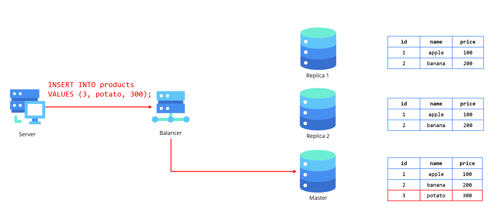
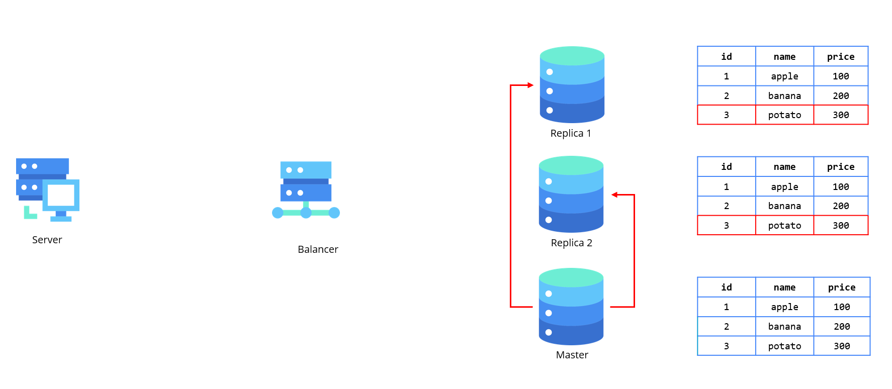

# Масштабирование реляционных баз данных


## Введение

В современных распределённых системах критически важно обеспечивать **масштабируемость**, **отказоустойчивость** и **высокую доступность**. Если система не справляется с возросшей нагрузкой, пользователи могут столкнуться с медленными откликами или полной недоступностью сервиса, что ведёт к ухудшению пользовательского опыта и финансовым потерям. Неспособность базы данных масштабироваться или восстанавливаться после сбоев может привести к потере данных, срыву бизнес-процессов и репутационным рискам. В условиях растущих объёмов данных и увеличения количества пользователей, традиционные реляционные системы начинают испытывать проблемы с производительностью и масштабируемостью. Важно понять, как обеспечить эффективное хранение и обработку данных при росте системы, сохраняя высокую доступность, целостность данных и производительность запросов. Как можно масштабировать реляционную базу данных, чтобы она оставалась эффективной и надёжной при увеличении нагрузки?

## Что такое реляционная база данных

Реляционные базы данных (РБД) — это тип баз данных, основанный на реляционной модели, предложенной Эдгаром Коддом в 1970 году. Данные в таких базах хранятся в виде таблиц (relation), где каждая строка представляет собой запись (кортеж), а столбцы — атрибуты этой записи.

### Основные характеристики реляционных БД:

Организует данные в виде таблиц, которые могут быть связаны между собой с помощью ключей, что позволяет поддерживать целостность и структуру информации. Каждый объект, например, пользователь или заказ, хранится в отдельных таблицах, а связи между ними обеспечивают гибкость в извлечении и обработке данных. Основные особенности реляционной модели включают нормализацию данных, использование SQL для запросов, поддержку транзакций для гарантии целостности и поддержку масштабируемости через индексацию.

### Популярные реляционные базы данных:

- **PostgreSQL** – мощная объектно-реляционная СУБД с поддержкой расширяемости и сложных типов данных.
- **MySQL** – широко используемая СУБД с открытым исходным кодом, популярна в веб-разработке.
- **Oracle Database** – коммерческая СУБД с высокой производительностью и масштабируемостью.
- **Microsoft SQL Server** – продукт от Microsoft, часто используемый в корпоративных средах.

## Возможности ускорения на уровне базы данных

Реляционные базы данных оснащены рядом встроенных механизмов, предназначенных для повышения производительности, что позволяет им эффективно справляться с большим количеством запросов с высокой скоростью. Для этого существует несколько подходов, таких как создание индексов, денормализация данных и эффективное представление выборок. Рассмотрим эти возможности более подробно.

### Индексы в базе данных

**Индексы** — это структуры данных, которые ускоряют операции поиска, сортировки и фильтрации в базе данных. Индекс позволяет быстро находить строки в таблице, не сканируя всю таблицу, что существенно увеличивает скорость выполнения запросов, особенно на больших объёмах данных.

Принцип работы индексов:
- **Индексы создаются на колонках**, которые часто используются в операциях поиска, сортировки, объединения и фильтрации.
- Обычно используется структура данных **B-дерево** или **Хеш-таблицы**, которые позволяют эффективно находить элементы по ключу.
- При добавлении, удалении или изменении данных в таблице индекс также обновляется, что добавляет небольшую нагрузку на операции записи, но ускоряет операции чтения.

Типы индексов:
1. **Уникальные индексы** — гарантируют, что значения в индексируемой колонке будут уникальными. Используются, например, для колонок с первичными и уникальными ключами.
2. **Композитные индексы** — создаются на нескольких колонках. Это полезно для запросов, использующих несколько полей для фильтрации или сортировки.
3. **Полнотекстовые индексы** — предназначены для эффективного поиска по текстовым данным, например, для поиска по словам в колонке типа `TEXT`.
4. **Индексы с обратным порядком** — используются для ускорения запросов, которые требуют сортировки в обратном порядке (например, по убыванию).

Преимущества:
- Существенно ускоряют выполнение SELECT-запросов.
- Позволяют значительно улучшить производительность запросов с операциями WHERE, JOIN, ORDER BY.

Недостатки:
- Индексы увеличивают время на операции INSERT, UPDATE, DELETE, так как индекс должен обновляться при изменении данных.
- Требуют дополнительного места для хранения данных.

### Денормализация базы данных

**Денормализация** — это процесс создания избыточных данных в базе данных с целью улучшения производительности при выполнении часто используемых запросов. Обычно денормализация используется, когда нормализация данных приводит к большому количеству JOIN-операций, которые замедляют выполнение запросов.

Принцип денормализации:
- В денормализованных базах данных таблицы могут содержать избыточные данные, что позволяет уменьшить количество соединений между таблицами.
- Вместо того чтобы хранить данные в нескольких связанных таблицах (нормализованная структура), денормализованные таблицы могут включать данные из других таблиц, что позволяет ускорить выполнение запросов, так как операции JOIN становятся не нужны.

Преимущества:
- Ускоряет SELECT-запросы, так как данные уже объединены в одной таблице.
- Уменьшается количество соединений (JOIN) между таблицами, что улучшает производительность при больших объёмах данных.

Недостатки:
- Повышает избыточность данных, что может привести к увеличению объёма базы данных.
- Требуется дополнительное внимание к синхронизации данных, так как изменение данных в одной таблице может потребовать обновления нескольких избыточных полей в других таблицах.

### Представление выборок в базе данных

**Представления (views)** — это виртуальные таблицы, которые предоставляют доступ к данным в определённом виде без необходимости хранить их физически. Представления определяются запросами SELECT, которые выполняются на реальных таблицах.

Принцип работы представлений:
- Представление может включать выборку, фильтрацию, сортировку и агрегацию данных из одной или нескольких таблиц.
- Пользователи могут обращаться к представлениям как к обычным таблицам, но данные на самом деле не хранятся в представлениях. Запросы к представлению выполняются на реальных данных в момент их обращения.

Преимущества:
- Упрощают работу с часто используемыми запросами, так как они позволяют хранить сложные запросы в виде простых объектов.
- Сокращают повторяющуюся логику в запросах, улучшая читаемость и поддержку кода.
- Могут быть использованы для ограничения доступа, скрывая сложность или чувствительные данные.

Недостатки:
- Представления могут снижать производительность, если они слишком сложны или включают много JOIN-операций, так как каждый запрос будет пересчитывать выборку.
- Могут быть менее эффективными по сравнению с материализованными представлениями (materialized views), которые хранят результаты запросов на диске.

### Материализованные представления:

Материализованные представления — это представления, которые хранят результаты выполнения запроса на диске, тем самым ускоряя доступ к данным, но увеличивая время на обновление данных при изменении исходных таблиц.

## Как можно масштабировать реляционные базы данных?

Реляционные базы данных были созданы несколько десятилетий назад и с тех пор прошли значительные эволюционные изменения, чтобы соответствовать требованиям современных технологий. Основные принципы их работы, такие как структура таблиц, использование SQL и обеспечение целостности данных, остались неизменными, что продолжает делать их надежным инструментом для множества критически важных систем. Однако в условиях быстрого роста данных и необходимости их оперативной обработки, традиционные реляционные базы данных начинают сталкиваться с ограничениями. Сегодня от БД требуется не только стабильность и согласованность, но и способность эффективно управлять большими объемами информации, обеспечивать низкие задержки при запросах и поддерживать высокую доступность, что подталкивает к внедрению новых подходов и технологий.

### Вертикальное масштабирование

**Вертикальное масштабирование** предполагает увеличение ресурсов одного сервера, на котором работает база данных. Это может быть увеличение процессорных мощностей, добавление оперативной памяти или расширение хранилища данных.

Преимущества вертикального масштабирования:
- **Простота и быстрота внедрения**: Вертикальное масштабирование не требует изменения архитектуры базы данных. Вы просто добавляете ресурсы на существующий сервер, и система может начать работать быстрее.
- **Минимизация сложности**: Нет необходимости в перераспределении данных или настройке сложных распределённых систем.
- **Низкие издержки на поддержку**: Использование одного мощного сервера упрощает процесс администрирования, так как количество серверов минимально.

Недостатки вертикального масштабирования:
- **Ограничения по аппаратным возможностям**: У каждого сервера есть физические ограничения по объёму памяти, мощности процессора и пропускной способности дисков. После достижения этих ограничений, вертикальное масштабирование становится невозможным.
- **Единичная точка отказа**: Если сервер выходит из строя, вся база данных может стать недоступной. Это создаёт риски для отказоустойчивости системы.
- **Рост стоимости**: Чем мощнее сервер, тем дороже он становится. Это может быть менее экономически эффективным, чем горизонтальное масштабирование.

### Горизонтальное масштабирование

**Горизонтальное масштабирование** предполагает добавление новых серверов или узлов в распределённую систему, что позволяет распределить нагрузку между несколькими экземплярами базы данных. Горизонтальное масштабирование может быть реализовано через **шардинг** и **репликацию**.

#### Репликация

**Репликация** — это процесс создания копий базы данных на разных серверах, которые могут использоваться для обработки запросов на чтение. Запросы на запись направляются на главный сервер (мастер), а запросы на чтение — на его реплики.

Основные типы репликации:

1. Мастер-слейв (Master-Slave)
2. Мастер-мастер (Multi-Master)
3. Синхронная репликация
4. Асинхронная репликация
5. Каскадная репликация

##### Master-Slave репликация

Это один из самых распространённых типов репликации, в котором один сервер является **мастером** (основным),
а остальные — **слейвами** (репликами).

Принцип работы:
- **Мастер-сервер** обрабатывает все запросы на запись (вставку, обновление, удаление).
- **Слейв-серверы** копируют данные с мастера и обрабатывают запросы на чтение. Обычно они синхронизируются с мастером
периодически или с задержкой (в зависимости от конфигурации).

Например, в следующем примере кластер базы данных состоит из 3 нод, из которых одна является мастером, а две другие - слейвами.
База данных имеет внутри себя таблицу `products`, которая содержит в себе следующую структуру:

```sql
CREATE TABLE products (
    id INT,
    product_name VARCHAR,
    price INT
);
```
Далее пользователь отправляет на балансировщик базы данных запрос, который добавляет в таблицу новую запись с помощью
следующего кода
```sql
INSERT INTO products VALUES (3, 'potato', 300);
```
Данный запрос маршрутизируется балансировщиком на мастер и записывается в него.



Далее, добавленная в мастер запись разносится на оставшиеся несинхронизированными слейвы.



Этот тип репликации представляет собой один из **самых простых вариантов**, что является его главным преимуществом в сравнении
с другими подходами. Простота реализации и настройки делает его привлекательным выбором для многих случаев. Однако, помимо
своей очевидной лёгкости, данная репликация позволяет **значительно повысить эффективность обработки запросов на чтение**.
Если в системе присутствует несколько слейвов, каждый из них может обрабатывать запросы на чтение, что способствует
равномерной нагрузке и уменьшает её на каждом отдельном сервере.

Тем не менее наряду с явными преимуществами, этот подход имеет и свои недостатки. Прежде всего, **отсутствие масштабируемости
на уровне мастера** ограничивает возможность разгрузки базы данных от запросов на чтение, что может стать сдерживающим фактором
при росте нагрузки. Также стоит учитывать, что система имеет **единую точку отказа** — мастер. В случае его сбоя кластер временно
теряет возможность записывать данные, что может повлиять на доступность и работу системы в целом.

##### Multi-Master репликация

Это тип репликации, в котором несколько серверов могут выполнять как операции чтения, так и записи. В отличие от модели
мастер-слейв, где только один сервер обрабатывает записи, в мастере-мастере несколько серверов могут одновременно
обрабатывать запросы на запись.

Наиболее распространенная причина иметь многоуровневую установку Multi-Master - это позволить нашему кластеру баз данных
обрабатывать больше трафика записи, чем один узел. Вертикальное масштабирование имеет теоретические и практические ограничения,
и машина не может выходить за пределы определенного масштаба.

Как правило, клиенты выбирают один из многих узлов Master для отправки своих запросов на Write. Затем эти обновления асинхронно распространяются другим Мастерам, сохраняя их синхронизацию с изменениями и делая систему в конечном итоге последовательной.

Преимущества:
- Отсутствует единая точка отказа
- Обновление версии базы данных до более новой версии без простоя
- Нужда в split-of-brain
Недостатки:

Поскольку репликация между Multi-Master асинхроннами, обновления, сделанные на одном Мастере, займет некоторое время, чтобы поразмышлять о других Мастерах, что делает систему в конечном итоге последовательной. Из-за этой возможной согласованности реляционная база данных, работающая в режиме Multi-Master, потеряет свои гарантии ACID.

Каждое изменение или добавление сущности, происходящее на одном Мастере, должно быть отправлено на каждый другой Узел Мастера в кластере. Это движение данных добавляет значительную нагрузку на пропускную способность сети и может привести к вялой производительности сети в масштабе.

Основной проблемой при запуске базы данных в режиме Multi-Master является Conflict. Поскольку все узлы Мастера принимают записи, могут возникнуть ситуации, когда одна и та же сущность обновляется на нескольких Учителя одновременно, что приводит к конфликтам при синхронизации. То, как эти конфликты решаются, зависит от применения. Некоторые варианты использования предполагают отбросить всю последовательность записей, в то время как другие будут означать, что последняя запись выигрывает. Это становится ответственностью бизнес-логики и варианта использования, чтобы определить шаги, которые должны быть предприняты в конфликте.

##### Синхронная репликация

Это тип репликации, при котором изменения, выполненные на **мастер-сервере**, немедленно транслируются на **слейв-серверы** до того, как транзакция считается завершённой. То есть запись считается успешной только тогда, когда она была успешно записана на всех репликах.

Преимущества синхронной репликации:
- **Гарантированная консистентность данных**: Все реплики всегда имеют актуальные данные, так как запись на мастер-сервере немедленно реплицируется на все слейвы.
- **Высокая степень согласованности**: Система всегда гарантирует, что все копии данных на репликах совпадают с данными на мастер-сервере, что минимизирует риск возникновения несоответствий.

Недостатки синхронной репликации:
- **Задержки при записи**: Из-за необходимости синхронизации с репликами, операции записи могут занимать больше времени. Это может ухудшить производительность системы, особенно при большом количестве записей.
- **Производственные нагрузки**: Из-за синхронизации данных система становится зависимой от скорости передачи данных между мастер-сервером и репликами. Это может стать узким местом для системы.

##### Асинхронная репликация

В этом режиме данные, записанные на **мастер-сервере**, не синхронизируются с репликами немедленно. Реплики получают изменения с некоторой задержкой, в зависимости от настроек синхронизации или интервалов.

Преимущества асинхронной репликации:
- **Высокая производительность**: Поскольку записи на мастер-сервере не ожидают синхронизации с репликами, операции записи выполняются быстро.
- **Минимальные задержки**: Запись данных на мастер-сервере не блокирует процесс выполнения, что улучшает производительность системы.
- **Уменьшение нагрузки на сеть**: Асинхронная репликация не требует постоянного обмена данными между мастер-сервером и репликами в реальном времени.

Недостатки асинхронной репликации:
- **Проблемы с консистентностью данных**: Из-за задержки в синхронизации данных между мастер-сервером и репликами, на репликах могут быть устаревшие данные, что может привести к ошибкам в чтении.
- **Риск потери данных**: Если мастер-сервер выходит из строя до того, как реплики синхронизируют изменения, данные, возможно, будут утеряны.

##### Каскадная репликация

Это тип репликации, при котором слейв-сервер может быть реплицирован на другие слейв-сервера. В этой архитектуре изменения, сделанные на **мастер-сервере**, сначала транслируются на первый уровень реплик, а затем от них — к последующим репликам.

Преимущества каскадной репликации:
- **Оптимизация нагрузки**: Избегается перегрузка мастера и первого уровня реплик, так как реплики могут делегировать часть своих запросов другим репликам.
- **Масштабируемость**: Легко расширять систему за счёт добавления новых слейв-реплик на каждом уровне, что позволяет эффективно распределять нагрузку.
- **Уменьшение трафика на мастер-сервере**: Мастер-сервер загружен только первичной репликацией, а остальные реплики могут передавать данные каскадно, снижая нагрузку на основную базу данных.

Недостатки каскадной репликации:
- **Дополнительная задержка**: Из-за того, что данные передаются через несколько уровней реплик, возникает дополнительная задержка в репликации данных, что может привести к рассогласованию на разных уровнях.
- **Сложность в настройке и управлении**: Поддержка каскадной репликации требует более сложной настройки и мониторинга, так как нужно отслеживать состояние всех уровней реплик.

#### Шардинг (Sharding)

**Шардинг** — это процесс разделения данных на несколько независимых частей (шардов), которые хранятся на разных серверах. Каждый шард содержит только часть данных, что позволяет снизить нагрузку на каждый отдельный сервер.

#### Range-based шардинг (Диапазонный)

Это ...

Как работает:
- Данные распределяются **по диапазонам значений**.
- Обычно используется `id` или временной интервал (`date`).
- Например:
    - `shard1` → `ID от 1 до 1000`
    - `shard2` → `ID от 1001 до 2000`
    - `shard3` → `ID от 2001 до 3000`

Плюсы:
- Простой в понимании
- Запросы по диапазону выполняются **очень быстро**
- Легко добавить новые шарды (создавая новые диапазоны)

Минусы:
- Если один диапазон получает **больше данных**, шард перегружается (нужно **балансировать** данные).
- Может потребоваться **перераспределение данных** при изменении диапазонов.

Когда использовать?
- Если данные можно логически разделить **по ID, дате, регионам**.  
- Хорошо подходит для **временных данных (логи, заказы, события)**.

#### Hash-based шардинг (По хэшу)

Как работает:
- Данные распределяются **равномерно** по шардам с помощью хэш-функции.
- Обычно берется `MOD(N)`, где `N` – количество шардов.
- Например, для 3-х шардов:
    - `shard1` → `id % 3 == 0`
    - `shard2` → `id % 3 == 1`
    - `shard3` → `id % 3 == 2`

Минусы:
- **Нельзя делать диапазонные запросы** (например, `id BETWEEN 1000 AND 2000`).
- Если добавляется новый шард, **все данные нужно перераспределять**.  
- `JOIN` и `GROUP BY` работают **медленнее**.

Когда использовать?  
- Если важно равномерное распределение нагрузки.  
- Подходит для **ключ-значение хранилищ** и **нагруженных API**.

#### Vertical шардинг

**Почему это полезно?**
1. **Ускоряет основную БД** 🏎
    - Если часто выполняются запросы **по ключевым полям (`id`, `name`, `email`)**, они работают быстрее, если в таблице нет "тяжелых" столбцов (`JSONB`, `TEXT`, `BLOB`).
2. **Разгружает дисковую и оперативную память** 💽
    - Большие данные (файлы, логи) хранятся отдельно → индексы в основной БД занимают меньше места.
3. **Оптимизирует бэкапы и репликацию** 🔄
    - Можно делать **бэкапы и репликацию только для важных данных**, а логи хранить отдельно (или вообще не бэкапить).
4. **Гибкость масштабирования** ⚙️
    - Основную БД можно **держать на SSD**, а логи и файлы — на HDD или в облаке (например, в **S3, MinIO**).

#### Directory-based шардинг (Каталожный / Lookup Table)

Как работает:
- Используется **внешняя таблица (lookup table)**, которая **указывает, где хранятся данные**.
- Например, у нас есть таблица, где написано:
    - `user_id 1-1000 → shard1`
    - `user_id 1001-2000 → shard2`
    - `user_id 2001-3000 → shard3`
- Перед выполнением запроса сначала идет запрос в **lookup table**, чтобы узнать, в какой шард отправлять данные.

Плюсы:
- **Гибкость** – можно легко менять логику распределения.
- Хорошо подходит для **динамических систем** (если данные могут мигрировать между шардами).  
- Поддерживает **любую стратегию шардинга** (диапазоны, хэш, регионы и т.д.).

Минусы:
- **Дополнительный запрос** перед основным (может замедлять работу).
- **Точка отказа** – если lookup table перегружена, вся система может тормозить.
- Требует **отдельного механизма обновления данных** (если изменяются шарды).

Когда использовать?
- Если нужно **гибкое распределение данных**.  
- Если шардинг сложный (по регионам, кастомной логике).  
- Подходит для **мультиарендных (multi-tenant) систем**.

##### Проблемы шардинга

- **Сложные межшардовые запросы (JOIN, агрегаты).**
- **Ребалансировка шардов** при изменении количества серверов.
- **Обновление схемы данных** без остановки системы.

## Вывод

Масштабирование реляционных баз данных — это важная задача для обеспечения их высокой производительности и доступности в условиях растущих объемов данных и запросов. Хотя реляционные БД традиционно славятся своей консистентностью и надежностью, с ростом требований к скорости обработки и масштабируемости, многие из них начинают сталкиваться с вызовами. Для решения этих проблем применяются различные подходы, такие как вертикальное и горизонтальное масштабирование, репликация и использование распределенных систем. Каждый из этих методов позволяет эффективно справляться с увеличивающейся нагрузкой, сохраняя при этом принципы работы реляционных БД. В будущем для достижения оптимальной производительности и гибкости, возможно, потребуется комбинированный подход, который объединяет традиционные реляционные технологии с новыми решениями, такими как NoSQL и распределенные системы, чтобы обеспечить быстрое и эффективное управление данными на всех уровнях.
